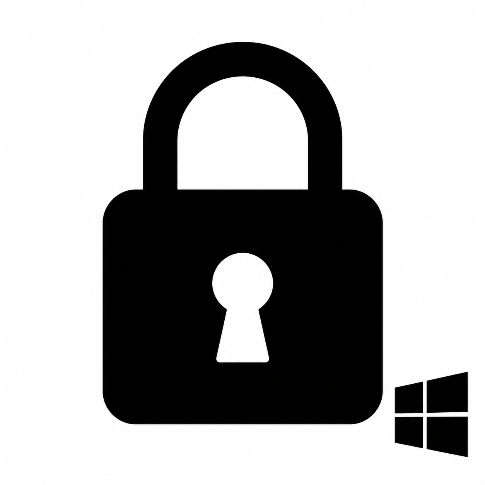

<div align="center">



# 🔒 InactivityLocker

**Bloqueio automático de sessão por inatividade — discreto, leve e seguro.**


</div>

---

## ✨ O que é?

**InactivityLocker** é uma aplicação Windows que roda silenciosamente na bandeja do sistema e **bloqueia a sessão automaticamente** após um período de inatividade configurável. Ideal para ambientes corporativos ou qualquer situação onde segurança e privacidade importam.

Sem janelas abertas, sem distrações — apenas proteção em segundo plano.

---

## ⚙️ Como funciona

```
Usuário inativo por N minutos
        ↓
InactivityLocker detecta (sem mouse, sem teclado)
        ↓
Sessão bloqueada 🔒
        ↓
Ao desbloquear, contagem é reiniciada do zero
```

Hooks globais de teclado e mouse são instalados via **WinAPI** para monitorar qualquer atividade do usuário — sem interceptar ou registrar o conteúdo digitado.

---

## 🚀 Funcionalidades

| Recurso | Descrição |
|---|---|
| 🕐 **Intervalo configurável** | Defina quantos minutos de inatividade antes do bloqueio |
| 🔑 **Proteção por senha** | Configurações e encerramento exigem autenticação |
| 🖥️ **System Tray** | Roda discretamente na bandeja — sem janela principal |
| 🔁 **Reset automático** | Ao desbloquear a sessão, o contador reinicia sozinho |
| 🚫 **Instância única** | Garante que apenas um processo rode por vez |

---

## 🛠️ Tecnologias

- **C# / .NET Framework 4.0**
- **WinForms** — interface na bandeja do sistema
- **WinAPI** — hooks globais de teclado e mouse (`SetWindowsHookEx`)
- **Microsoft.Win32** — detecção de bloqueio/desbloqueio de sessão

---

## 📦 Como usar

### Pré-requisitos
- Windows 7 ou superior
- .NET Framework 4.0+

### Compilar e executar

```bash
# Clone o repositório
git clone https://github.com/marcelo-belotto/InactivityLocker.git

# Abra InactivityLocker.sln no Visual Studio
# Build → Release → Execute InactivityLocker.exe
```

### Na primeira execução

1. O ícone de cadeado aparece na bandeja do sistema
2. O monitoramento começa imediatamente (padrão: **1 minuto**)
3. Clique com o botão direito no ícone para configurar o intervalo ou sair

---

## 🖱️ Menu da bandeja

```
● Monitorando
─────────────────────
  Configurar intervalo...   ← requer senha
─────────────────────
  Sair                      ← requer senha
```

---

## 📁 Estrutura do projeto

```
InactivityLocker/
├── Program.cs                  # Ponto de entrada, controle de instância única
├── TrayApplicationContext.cs   # Contexto da aplicação + ícone da bandeja
├── InactivityMonitor.cs        # Timer de inatividade
├── GlobalHookManager.cs        # Hooks globais de teclado e mouse (WinAPI)
├── LockSession.cs              # Realiza o bloqueio da sessão
├── IntervalConfigForm.cs       # Formulário de configuração do intervalo
└── assets/
    ├── logo.png
    └── app.ico
```

---

<div align="center">

Feito com ☕ e C# &nbsp;·&nbsp; Contribuições são bem-vindas!

</div>
